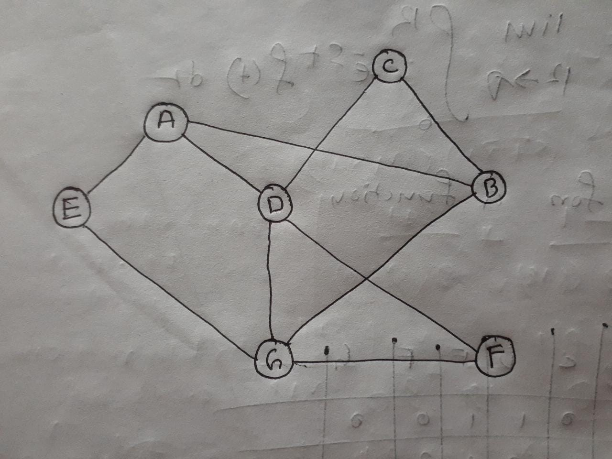

# LAB08 Trees and Graphs Solutions

## Definition of a Tree Node
``` java
    public class TreeNode {
        int val;
        TreeNode left;
        TreeNode right;
        public TreeNode(int n) {
            val = n;
            left = null;
            right = null;
        }
    }
```

## Assuming this is the input tree
```
               1 
              / \
             2   3
            / \   \
           4   8   10
         /
        5
```

## Problem 01: RECURSIVELY calculate the height of a tree.
``` java
    private int dfs(TreeNode root, int height) {
        if (root == null) return height;
        return Math.max(dfs(root.left, height), dfs(root.right, height + 1));
    }

    public int heightOfTree(TreeNode root) {
        return dfs(root, 0);
    }
```
## Problem 02: RECURSIVELY calculate the level of a Node in a tree.
``` java
    private int levelOfNodeHelper(TreeNode root, TreeNode target, int level) {
        if (root == null) return -1;
        if (root.val == target.val) return level;
        int leftSubtree = levelOfNodeHelper(root.left, target, level + 1);
        if (leftSubtree > -1) return leftSubtree;
        return levelOfNodeHelper(root.right, target, level + 1);
    }

    public int levelOfNode(TreeNode root, TreeNode target) {
        // will return 0 if the target node is not present int the binary tree
        return levelOfNodeHelper(root, target, 1);
    }
```

## Problem 03: Print elements of all the Nodes of a tree using Pre-order Traversal.
``` java
    public void preOrderTraversal(TreeNode root) {
        if (root == null) return;
        System.out.print(root.val + " ");
        preOrderTraversal(root.left);
        preOrderTraversal(root.right);
    }
```

## Problem 04: Print elements of all the Nodes of a tree using In-order Traversal.
``` java
    public void inOrderTraversal(TreeNode root) {
        if (root == null) return;
        inOrderTraversal(root.left);
        System.out.print(root.val + " ");
        inOrderTraversal(root.right);
    }
```

## Problem 05: Print elements of all the Nodes of a tree using Post-order Traversal.
``` java
    public void postOrderTraversal(TreeNode root) {
        if (root == null) return;
        postOrderTraversal(root.left);
        postOrderTraversal(root.right);
        System.out.print(root.val + " ");
    }
```

## Problem 06: Write a method which will evaluate whether two trees are exactly same or not.
``` java
    public boolean sameTree(TreeNode root1, TreeNode root2) {
        if (root1 == null && root2 == null) return true;
        if (root1 == null || root2 == null) return false;
        return root1.val == root2.val && sameTree(root1.left, root2.left) && sameTree(root1.right, root2.right);
    }
```

## Problem 07: Write a method which will return a copy (new tree) of a given tree.
``` java
    public TreeNode copyTree(TreeNode root) {
        if (root == null) return null;
        TreeNode newRoot = new TreeNode(root.val);
        newRoot.left = copyTree(root.left);
        newRoot.right = copyTree(root.right);
        return newRoot;
    }
```

## Problem 08: An adjacency matrix is given below. Draw the equivalent graph.


## For testing purpose all the code including the tester class has been attached below  

``` java
    public class TreesAndGraphsTester {
    public static void main(String[] args) {
        TreesAndGraphsTester tester = new TreesAndGraphsTester();
        displayTree();
        TreeNode root = new TreeNode(1);
        root.left = new TreeNode(2);
        root.right = new TreeNode(3);
        root.left.left = new TreeNode(4);
        root.left.left.left = new TreeNode(5);
        root.left.right = new TreeNode(8);
        root.right.right = new TreeNode(10);
        // height of tree(assuming we start counting height from zero)
        System.out.println("\n################################");
        System.out.println("Problem 01: RECURSIVELY calculate the height of a tree");
        System.out.println("################################");
        System.out.println("The height of the tree is " + tester.heightOfTree(root));
        // level of node(assuming we start counting level from zero)
        System.out.println("\n################################");
        System.out.println("Problem 02: RECURSIVELY calculate the level of a Node in a tree");
        System.out.println("################################");
        System.out.println("The level of node with value 8 is: " + tester.levelOfNode(root, root.right.right));
        // Preorder Traversal
        System.out.println("\n################################");
        System.out.println("Problem 03: Print elements of all the Nodes of a tree using Pre-order Traversal");
        System.out.println("################################");
        System.out.print("Preorder Traversal: ");
        tester.preOrderTraversal(root);
        System.out.println();
        // Inorder Traversal
        System.out.println("\n################################");
        System.out.println("Problem 04: Print elements of all the Nodes of a tree using In-order Traversal");
        System.out.println("################################");
        System.out.print("Inorder Traversal: ");
        tester.inOrderTraversal(root);
        System.out.println();
        // Postorder Traversal
        System.out.println("\n################################");
        System.out.println("Problem 05: Print elements of all the Nodes of a tree using Post-order Traversal");
        System.out.println("################################");
        System.out.print("Postorder Traversal: ");
        tester.postOrderTraversal(root);
        System.out.println();
        // Same Tree
        // For this problem we will create two separate trees
        // one will be the same as the previous
        // other one will be different
        System.out.println("\n################################");
        System.out.println("Problem 06: Write a method which will evaluate whether two trees are exactly same or not");
        System.out.println("################################");
        TreeNode root1 = new TreeNode(1);
        root1.left = new TreeNode(2);
        root1.right = new TreeNode(3);
        root1.left.left = new TreeNode(4);
        root1.left.left.left = new TreeNode(5);
        root1.left.right = new TreeNode(8);
        root1.right.right = new TreeNode(10);

        TreeNode root2 = new TreeNode(1);
        root2.left = new TreeNode(4);
        root2.right = new TreeNode(3);
        root2.left.left = new TreeNode(4);
        root2.left.left.left = new TreeNode(6);
        root2.left.right = new TreeNode(8);

        System.out.println("Same Tree: " + tester.sameTree(root, root1));
        System.out.println("Same Tree: " + tester.sameTree(root, root2));

        // For the Copy Tree Method we will copy the initial tree
        // For the testing purpose we will use the Preorder Traversal method
        System.out.println("\n################################");
        System.out.println("Problem 07: Write a method which will return a copy (new tree) of a given tree");
        System.out.println("################################");
        System.out.print("Initial Tree: ");
        tester.preOrderTraversal(root);
        System.out.println();
        TreeNode newTreeNode = tester.copyTree(root);
        System.out.print("Copied new Tree: ");
        tester.preOrderTraversal(newTreeNode);
        System.out.println();
    }

    private static void displayTree() {
        System.out.println("################################");
        System.out.println("Tree Display");
        System.out.println("################################");
        System.out.println("       1");
        System.out.println("      / \\");
        System.out.println("     2   3");
        System.out.println("    / \\   \\");
        System.out.println("   4   8   10");
        System.out.println("  /");
        System.out.println(" 5");
    }

    private int dfs(TreeNode root, int height) {
        if (root == null) return height;
        return Math.max(dfs(root.left, height), dfs(root.right, height + 1));
    }

    public int heightOfTree(TreeNode root) {
        return dfs(root, 0);
    }

    private int levelOfNodeHelper(TreeNode root, TreeNode target, int level) {
        if (root == null) return -1;
        if (root.val == target.val) return level;
        int leftSubtree = levelOfNodeHelper(root.left, target, level + 1);
        if (leftSubtree > -1) return leftSubtree;
        return levelOfNodeHelper(root.right, target, level + 1);
    }

    public int levelOfNode(TreeNode root, TreeNode target) {
        // will return 0 if the target node is not present int the binary tree
        return levelOfNodeHelper(root, target, 0);
    }

    public void preOrderTraversal(TreeNode root) {
        if (root == null) return;
        System.out.print(root.val + " ");
        preOrderTraversal(root.left);
        preOrderTraversal(root.right);
    }

    public void inOrderTraversal(TreeNode root) {
        if (root == null) return;
        inOrderTraversal(root.left);
        System.out.print(root.val + " ");
        inOrderTraversal(root.right);
    }

    public void postOrderTraversal(TreeNode root) {
        if (root == null) return;
        postOrderTraversal(root.left);
        postOrderTraversal(root.right);
        System.out.print(root.val + " ");
    }

    public boolean sameTree(TreeNode root1, TreeNode root2) {
        if (root1 == null && root2 == null) return true;
        if (root1 == null || root2 == null) return false;
        return root1.val == root2.val && sameTree(root1.left, root2.left) && sameTree(root1.right, root2.right);
    }

    public TreeNode copyTree(TreeNode root) {
        if (root == null) return null;
        TreeNode newRoot = new TreeNode(root.val);
        newRoot.left = copyTree(root.left);
        newRoot.right = copyTree(root.right);
        return newRoot;
    }
}

class TreeNode {
    int val;
    TreeNode left;
    TreeNode right;
    public TreeNode(int n) {
        val = n;
        left = null;
        right = null;
    }
}
```

## Here is the output
```
################################
Tree Display
################################
       1
      / \
     2   3
    / \   \
  4   8   10
 /
5

################################
Problem 01: RECURSIVELY calculate the height of a tree
################################
The height of the tree is 3

################################
Problem 02: RECURSIVELY calculate the level of a Node in a tree
################################
The level of node with value 8 is: 2

################################
Problem 03: Print elements of all the Nodes of a tree using Pre-order Traversal
################################
Preorder Traversal: 1 2 4 5 8 3 10 

################################
Problem 04: Print elements of all the Nodes of a tree using In-order Traversal
################################
Inorder Traversal: 5 4 2 8 1 3 10 

################################
Problem 05: Print elements of all the Nodes of a tree using Post-order Traversal
################################
Postorder Traversal: 5 4 8 2 10 3 1 

################################
Problem 06: Write a method which will evaluate whether two trees are exactly same or not
################################
Same Tree: true
Same Tree: false

################################
Problem 07: Write a method which will return a copy (new tree) of a given tree
################################
Initial Tree: 1 2 4 5 8 3 10 
Copied new Tree: 1 2 4 5 8 3 10 
```
